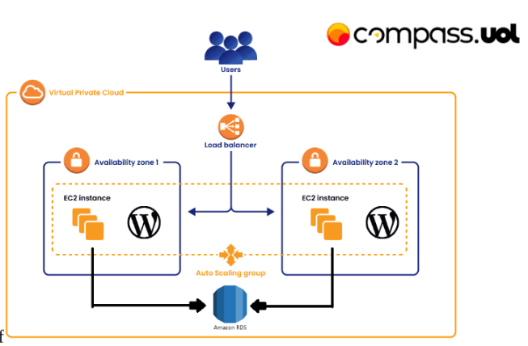
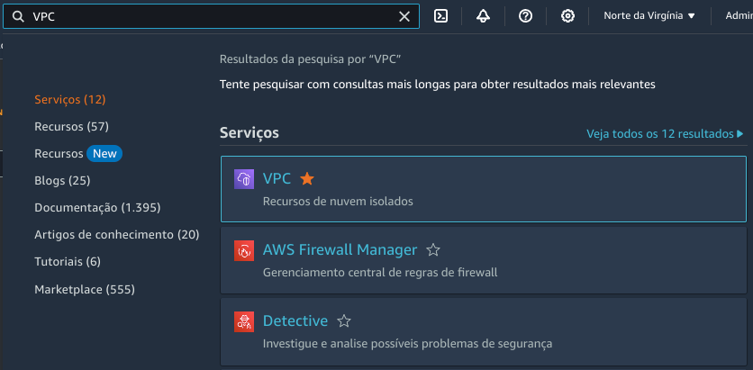
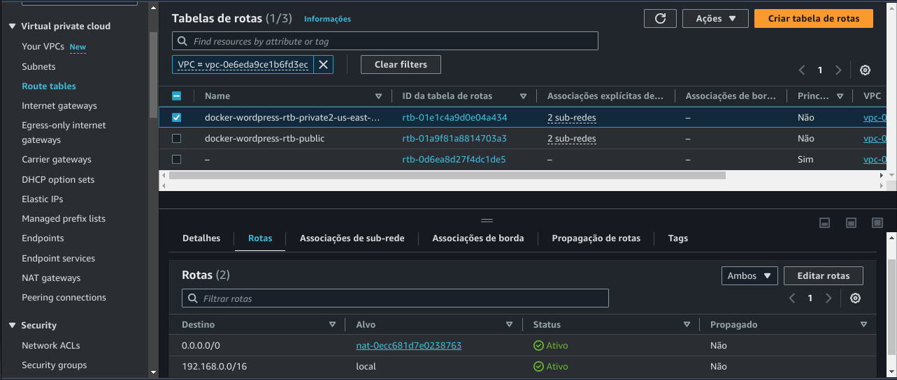

# Atividade 02 - Trilha de DevSecOps

> Atividade sobre Docker que pertence a trilha de DevSecOps do Programa de bolsas da Compass UOL.

## Descrição da atividade

> Requisitos da atividade:

- instalação e configuração do DOCKER ou CONTAINERD no host EC2;
  - Ponto adicional para o trabalho utilizar a instalação via script de Start Instance (user_data.sh).
- Efetuar Deploy de uma aplicação Wordpress com:
  - container de aplicação RDS
  - database Mysql.
- Configuração da utilização do serviço EFS AWS para estáticos do container de aplicação Wordpress;
- Configuração do serviço de Load Balancer AWS para a aplicação Wordpress;

## Execução da atividade

> ### Passo 1: Criação e configuração da VPC

- No console da AWS, busque por `VPC` 
- Em seguida, clique em `Criar VPC`
- Na tela de criação da VPC, preencha os campos conforme é necessário, lembre-se de fazer a criação das subnets e da tabela de rota.
- Após a criação da VPC, vá até o menu de `NAT Gateways` e crie um NAT Gateway para a VPC criada.
- ATENÇÃO: Não esqueça de colocar o NAT em uma subnet pública;
- Após a criação do NAT, vá até o menu de `Route Tables` e crie uma tabela de rotas para as subnets privadas para o NAT Gateway criado.  
