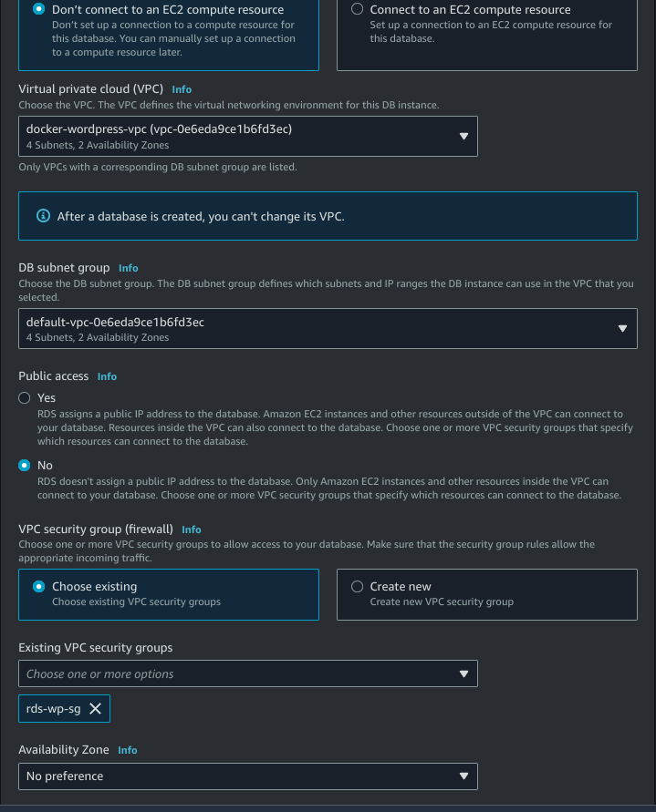

# Atividade 02 - Trilha de DevSecOps

> Atividade sobre Docker que pertence a trilha de DevSecOps do Programa de bolsas da Compass UOL.

## Descrição da atividade

> Requisitos da atividade:

- instalação e configuração do DOCKER ou CONTAINERD no host EC2;
  - Ponto adicional para o trabalho utilizar a instalação via script de Start Instance (user_data.sh).
- Efetuar Deploy de uma aplicação Wordpress com:
  - container de aplicação RDS
  - database Mysql.
- Configuração da utilização do serviço EFS AWS para estáticos do container de aplicação Wordpress;
- Configuração do serviço de Load Balancer AWS para a aplicação Wordpress;

## Execução da atividade

> ### Passo 1: Criação e configuração da VPC

- No console da AWS, busque por `VPC` 
- Em seguida, clique em `Criar VPC`
- Na tela de criação da VPC, preencha os campos conforme é necessário, lembre-se de fazer a criação das subnets e da tabela de rota.
- Após a criação da VPC, vá até o menu de `NAT Gateways` e crie um NAT Gateway para a VPC criada.
- ATENÇÃO: Não esqueça de colocar o NAT em uma subnet pública;
- Após a criação do NAT, vá até o menu de `Route Tables` e crie uma tabela de rotas para as subnets privadas para o NAT Gateway criado. 
- Para verificar se sua VPC está correta, vá em `Suas VPCS` e selecione a VPC criada e verifique o resource map, como na imagem a seguir: 

> ### Passo 2: Criação e configuração do Security Groups

- No menu EC2 procure por `Security groups` na barra de navegação à esquerda.

- Acesse e clique em `Criar novo grupo de segurança`, e crie os grupos de segurança a seguir

#### SG-ALB

| Type | Protocol | Port Range | Source Type | Source    |
| ---- | -------- | ---------- | ----------- | --------- |
| SSH  | TCP      | 22         | Anywhere    | 0.0.0.0/0 |
| HTTP | TCP      | 80         | Anywhere    | 0.0.0.0/0 |
| ICMP | ICMP     | ALL        | Anywhere    | 0.0.0.0/0 |

#### SG-EC2

| Type | Protocol | Port Range | Source Type | Source |
| ---- | -------- | ---------- | ----------- | ------ |
| SSH  | TCP      | 22         | Anywhere    | SG-ALB |
| HTTP | TCP      | 80         | Custom      | SG-ALB |

#### SG-EFS

| Type | Protocol | Port Range | Source Type | Source |
| ---- | -------- | ---------- | ----------- | ------ |
| NFS  | TCP      | 2049       | Anywhere    | SG-ALB |

#### SG-RDS

| Type         | Protocol | Port Range | Source Type | Source |
| ------------ | -------- | ---------- | ----------- | ------ |
| MYSQL/Aurora | TCP      | 3306       | Anywhere    | SG-ALB |

> ### Passo 3: Criando o EFS

- Busque por `EFS` na Amazon AWS o serviço de arquivos de NFS escalável da AWS.

- Na Página de EFS clique em `Criar sistema de arquivos`.

- Clique em personalizar.

- Selecione o SG criado para o EFS e finalize a criação.

> ### Passo 4: Criando o RDS

- Busque por RDS na Amazon AWS.

- Na página de RDS clique em `Create database`.

- Escolha o método de criação

- Em `Engine options` selecione **MySQL**

- Em `Templates` selecione **Free tier**

- Em `Settings` dê um nome identificador para o **DB**.
- Escolha um `username`.
- Escolha uma `senha`.

- Determine o tipo da instância e o tamanho do armazenamento em `Storage`.

- Selecione a VPC criada.
- Deixe o acesso publico como **NO**
- Selecione o **SG-RDS**.

- Vá em `Configurações Adicionais` e crie uma database inicial.

> ### Passo 5: Criando o template do EC2

- Na AWS busque por EC2
- No menu de EC2 clique em Modelos de Execução.
- Vá em `Criar modelo de execução`.
- Configure o template com forme solicitado.
- No campo advanced details vá até o quadro do User data copie e cole o user_data.sh.

> ### Passo 6: Criando o Target group

- No menu EC2 procure por `Grupos de destino` na barra de navegação à esquerda.
- Acesse e clique em `Criar grupo de destino`.

- Em `Escolha um tipo de destino` clique em `Instâncias`.
- Nomeie o grupo de destino.
- Em `Protocolo` mantenha `HTTP` e em `Porta` mantenha a porta `80`.
- Como `VPC` selecione a VPC criada anteriormente.
- Mantenha a `Versão do protocolo` como `HTTP1`.
- A seguir clique em `Próximo`.
- Na página de `Registrar destinos` e não selecione nenhuma instância.
- Selecione `Criar grupo de destino`.
- **ATENÇÃO:** Após a instância serem criadas, volte ao grupo de destino e selecione as instâncias criadas indo em `Registrar Destinos`.

> ### Passo 7: Criando o Load balancer

- No menu EC2 procure por `load Balancer` na barra de navegação à esquerda.
- Acesse e clique em `Criar load balancer`.
- Selecione `Criar` Application Load Balancer.
- Nomeie o load balancer.
- Em `Esquema` selecione `Voltado para a internet`.
- Em `Tipo de endereço IP` mantenha `IPv4`.
- Na aba `Mapeamento de rede` selecione a rede VPC.
- Selecione as duas subnets públicas criadas anteriormente.
- Como `Grupo de segurança` selecione o **SG-ALB**.
- Em `Listeners e roteamento` mantenha `HTTP`:`80` e selecione o grupo de destino criado anteriormente.
- Clique em `Criar load Balancer`.

> ### Passo 8: Criando o Auto Scaling

- No menu EC2 procure por `Auto Scaling` na barra de navegação à esquerda.
- Acesse e clique em `Criar grupo do Auto Scaling`.
- Nomeio o grupo de Auto Scaling.
- Selecione o modelo de execução criado anteriormente.
- A seguir clique em `Próximo`.
- Selecione a VPC criada anteriormente.
- Selecione as Sub-redes Privadas.
- A seguir clique em `Próximo`.
- Marque a opção `Anexar a um balanceador de carga existente`.
- Marque a opção `Escolha entre seus grupos de destino de balanceador de carga`.
- Selecione o grupo de destino criado anteriormente.
- A seguir clique em `Próximo`.
- Em `Tamanho do grupo` selecione:
  - Capacidade desejada: 2
  - Capacidade mínima: 2
  - Capacidade máxima: 4
- A seguir clique em `Pular para a revisão`.
- Clique em `Criar grupo de auto Scaling`.
